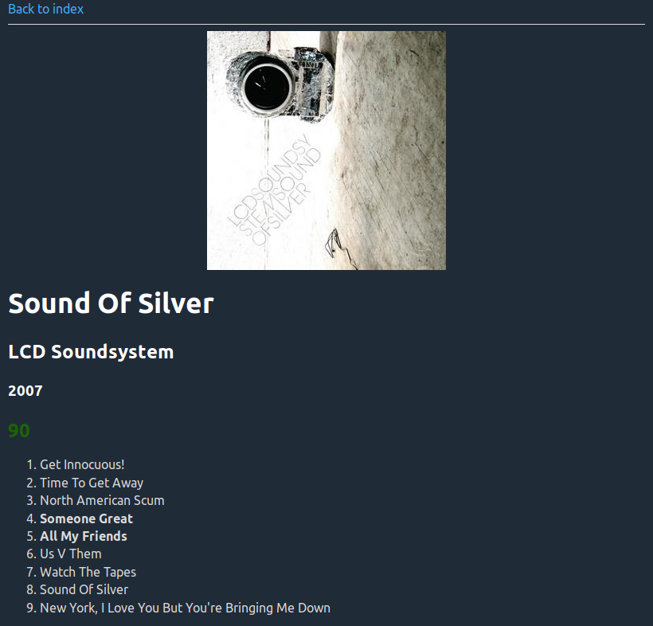

# musicreviews

Python package for managing a collection of personal music reviews I write. Uses my other package [powerspot](https://github.com/theodcr/powerspot).

Music album reviews are written in Markdown with YAML front matter. The command-line interface lets you:
- create reviews:
    - for the album currently playing on your Spotify account
    - by selecting an album saved on your Spotify account
    - by searching for an album on Spotify
    - by manually entering metadata
- create indexes by year, decade, rating and more
- automatically generate and upload "yearly favorite tracks" playlists
- track review writing progression
- convert reviews and indexes to HTML to create a full static website

Example of a review with generated HTML page:
```markdown
---
date: 2018-11-10
artist: LCD Soundsystem
album: Sound Of Silver
year: 2007
uri: spotify:album:1R8kkopLT4IAxzMMkjic6X
rating: 90
tracks:
    1: Get Innocuous!
    2: Time To Get Away
    3: North American Scum
    4: Someone Great
    5: All My Friends
    6: Us V Them
    7: Watch The Tapes
    8: Sound Of Silver
    9: New York, I Love You But You're Bringing Me Down
picks:
- 4
- 5
state: .
---

(content is written here)
```


